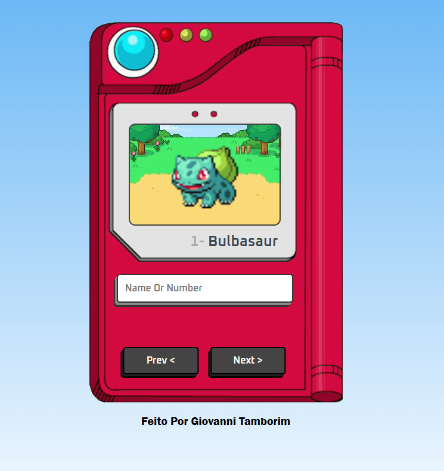

# Pokédex GIVA

Este é um projeto simples de Pokédex feito com HTML, CSS e JavaScript, que consome a [PokeAPI](https://pokeapi.co/) para buscar informações de Pokémon em tempo real.

## 🖼️ Preview



*A interface simula uma Pokédex clássica com um visual retrô e interativo. É possível visualizar o nome, número e sprite animado de cada Pokémon, com uma navegação simples.*

## 🔍 Funcionalidades

- Buscar Pokémon por nome ou número
- Exibir imagem animada, nome e número do Pokémon
- Navegação entre Pokémon usando botões "Prev" e "Next"
- Interface estilizada com visual semelhante à Pokédex clássica

## 🧑‍💻 Tecnologias Utilizadas

- HTML5
- CSS3
- JavaScript (ES6)
- [PokeAPI](https://pokeapi.co/)

## 📁 Estrutura de Arquivos

```
/index.html         - Página principal
/css/style.css      - Estilos do projeto
/js/script.js       - Lógica de interação e consumo da API
/images/            - Imagem da Pokédex
/favicons/          - Ícone da aba
```

## ▶️ Como Usar

1. Clone o repositório:
   ```bash
   git clone https://github.com/seu-usuario/pokedex-giva.git
   ```

2. Abra o arquivo `index.html` no navegador.

> 💡 É necessário estar conectado à internet para carregar os dados da API e as fontes.

## 👨‍🎨 Autor

Feito com 💙 por **Giovanni Tamborim**

---

**Licença:** Este projeto está sob a licença MIT.
